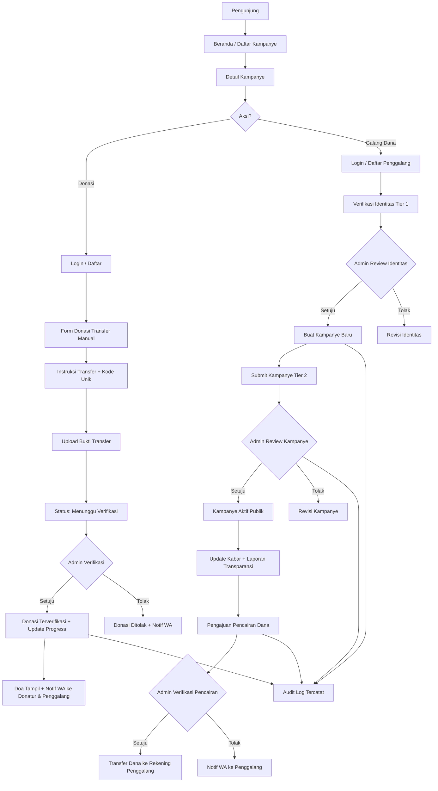

# DonasiUmat

---

## 1. Ringkasan & Tujuan Aplikasi
*Bagian ini menjelaskan gambaran umum proyek agar dipahami bersama oleh pemilik ide/klien dan tim pengembang.*
- **Nama Aplikasi**: DonasiUmat — Platform Galang Dana & Donasi Online Berbasis Komunitas
- **Penjelasan Singkat**: DonasiUmat adalah platform crowdfunding sosial yang menghubungkan penggalang dana (individu/lembaga/yayasan) dengan para donatur dermawan melalui kampanye yang transparan, akuntabel, dan mudah dilacak penyalurannya. Fokus utama kami adalah **kepercayaan (trust)** lewat verifikasi berlapis, laporan penggunaan dana yang bisa dibuktikan foto, serta kolom doa yang menumbuhkan rasa kebersamaan.
- **Masalah yang Diselesaikan**:
  - Sulitnya menemukan platform donasi yang benar-benar transparan soal ke mana dana disalurkan.
  - Maraknya kasus penipuan galang dana online karena tidak ada verifikasi identitas penggalang.
  - Tidak adanya jejak audit (audit trail) yang bisa dipertanggungjawabkan jika terjadi sengketa.
  - Donatur tidak bisa memantau progres penyaluran setelah mereka berdonasi, sehingga kepercayaan menurun.
  - Penggalang dana perorangan/komunitas kecil kesulitan mengelola donasi secara rapi (rekap donatur, bukti transfer, laporan).
- **Pengguna Aplikasi**:
  - **Pengunjung (Publik)**: Melihat daftar kampanye, membaca detail, mencari kampanye, tanpa perlu login.
  - **Donatur (User Terdaftar)**: Berdonasi, mengirim doa/pesan, melihat riwayat donasi dan status verifikasi transfernya.
  - **Penggalang Dana (Fundraiser)**: Membuat kampanye, mengunggah identitas untuk verifikasi, mengirim update kabar, mengunggah laporan transparansi, mengajukan pencairan.
  - **Admin/Pengelola Utama**: Memverifikasi identitas penggalang, mereview & mempublikasikan kampanye, memverifikasi bukti transfer donatur, memverifikasi pencairan dana, memantau audit log.
  - **Super Admin (opsional, dijembatani role admin lanjutan)**: Mengelola semua data, mengatur kategori, dan melihat seluruh log sistem.
- **Target Keberhasilan**:
  - Minimal 100 kampanye terverifikasi ramah dalam 6 bulan pertama setelah rilis.
  - Rata-rata tingkat konversi pengunjung → donatur minimal 2,5% per kampanye aktif.
  - Waktu verifikasi bukti transfer manual maksimal 1x24 jam setelah donatur mengunggah bukti.
  - 100% kampanye yang telah selesai memiliki minimal 1 laporan penyaluran dana (dengan foto bukti).
  - Tingkat retensi donatur (donasi ulang) minimal 20% per kuartal.

---

## 2. Batasan Pembuatan Sistem (Versi Awal MVP)
*Menegaskan fitur apa yang dikerjakan di versi awal dan apa yang sengaja ditunda agar aplikasi cepat selesai dan tidak membengkak (mencegah scope creep).*

### ✅ Yang Dikerjakan:
- Autentikasi Email & Password (Supabase Auth) untuk Donatur, Penggalang Dana, dan Admin.
- Halaman publik: Beranda, Daftar Kampanye, Detail Kampanye, Tentang, Cara Kerja, Kontak, FAQ.
- Pembuatan kampanye oleh penggalang dana (upload foto, deskripsi, target dana, deadline, kategori, lokasi penerima manfaat).
- Verifikasi berlapis: upload identitas penggalang (KTP/SIM/Passport) → direview manual oleh admin.
- Modul donasi dengan metode **Transfer Manual**: donatur memasukkan nominal, memilih bank/e-wallet tujuan, transfer, lalu upload bukti transfer + ongkos unik.
- Verifikasi bukti transfer oleh Admin (approve/reject dengan alasan).
- Progress bar target dana & counter jumlah donatur real-time.
- Kolom Doa & Pesan Donatur di tiap kampanye (dengan opsi anonim).
- Update Kabar Terbaru dari penggalang (timeline update).
- Daftar Donatur & riwayat donasi pada halaman detail kampanye.
- Modul Laporan Transparansi Penyaluran Dana & Bukti Foto (upload minimal 1 foto + keterangan jumlah dana digunakan).
- Pengajuan pencairan dana (withdrawal request) oleh penggalang yang diverifikasi admin.
- Notifikasi WhatsApp Gateway: status verifikasi identitas, kampanye disetujui/ditolak, donasi terverifikasi, kampanye mencapai target, update kampanye baru, pencairan disetujui.
- Audit log untuk seluruh aksi penting pada kampanye (create, update, submit verification, admin approval, dll.).
- Dasbor admin: kelola pengguna, kelola kampanye, kelola transaksi, verifikasi bukti transfer, verifikasi pencairan, lihat audit log.

### ⛔ Yang Tidak Dikerjakan di Versi Awal:
- Dompet saldo elektronik penggalang (auto-disbursement otomatis) — dana tetap dikirim manual ke rekening setelah pencairan disetujui.
- KYC otomatis dengan pihak ketiga (OCR KTP/eKYC) — masih manual review admin.
- Fitur langganan donasi rutin (bulanan/mingguan).
- Fitur koin/poin gamifikasi dan leaderboard donatur.
- Aplikasi mobile native (Android/iOS).
- Multi-bahasa (hanya Bahasa Indonesia di MVP).
- Payment gateway otomatis (QRIS/VA otomatis) — di MVP hanya **Transfer Manual**, integrasi gateway otomatis direncanakan di fase lanjutan.
- Integrasi email marketing/CRM.
- Fitur referral & kode afiliasi.

---

## 3. Daftar Halaman & Struktur Menu (Pages & Routing)
*Daftar lengkap halaman yang harus dibuat, dikelompokkan berdasarkan area atau peran pengguna (Role).*

### A. Public Area (Tanpa Login)
- `/` (Beranda): Hero, kampanye unggulan/darurat, kategori populer, statistik platform (total dana terkumpul, total donatur), kampanye mendesak, kartu CTA "Mulai Galang Dana".
- `/kampanye` (Daftar Kampanye): Grid kampanye dengan filter kategori, lokasi, urutan (terbaru, hampir tercapai, paling banyak donasi), search bar, pagination.
- `/kampanye/[slug]` (Detail Kampanye): Cover image, judul, penggalang, progress bar, target & terkumpul, jumlah donatur, sisa hari, tombol "Donasi Sekarang", deskripsi lengkap, galeri, tab modul (Kabir/Update, Doa & Pesan, Daftar Donatur, Laporan Transparansi), sidebar sticky CTA.
- `/kampanye/[slug]/donasi` (Form Donasi): Input nominal, pilih ongkos unik, instrusksi transfer bank, upload bukti transfer, kirim doa/pesan, opsi anonim.
- `/penggalang/[username]` (Profil Publik Penggalang): Info penggalang, total kampanye, total dana dihimpun, badge terverifikasi.
- `/tentang` (Tentang Kami): Cerita DonasiUmat, visi misi, tim, dampak.
- `/cara-kerja` (Cara Kerja): Alur donasi untuk donatur + alur galang dana untuk penggalang, FAQ singkat.
- `/kontak` (Kontak): Form kontak, WhatsApp CS, alamat kantor, jam operasional.
- `/faq` (FAQ): Accordion pertanyaan umum (akordeon dikelompokkan: Donatur, Penggalang, Keamanan, Pembayaran).
- `/syarat-ketentuan` (Syarat & Ketentuan): Halaman legal statis.
- `/kebijakan-privasi` (Kebijakan Privasi): Halaman legal statis.

### B. Donatur Area (Setelah Login)
- `/dashboard` (Dasbor Donatur): Ringkasan total donasi, riwayat terbaru, status verifikasi transfer, kampanye yang didukung.
- `/dashboard/riwayat-donasi` (Riwayat Donasi): Tabel donasi dengan status (Menunggu Verifikasi, Terverifikasi, Ditolak), filter, detail per transaksi.
- `/dashboard/riwayat-donasi/[id]` (Detail Donasi): Detail transaksi, bukti transfer yang diunggah, status, opsi unduh kuitansi.
- `/dashboard/doa-saya` (Doa Saya): Daftar doa/pesan yang pernah dikirim, edit/hapus doa (dalam 24 jam pertama).
- `/dashboard/profil` (Profil Saya): Edit nama, no. HP (untuk notifikasi WA), foto profil, ubah password.
- `/dashboard/notifikasi` (Notifikasi): Daftar notifikasi sistem (riwayat WhatsApp log + in-app).

### C. Penggalang Dana Area (Setelah Login & Verifikasi)
- `/galang-dana` (Landing Page Penggalang): Penjelasan benefit, alur pengajuan, tombol "Mulai Galang Dana".
- `/galang-dana/verifikasi-identitas` (Verifikasi Identitas): Form upload KTP/SIM/Passport + selfie dengan KTP, no. HP, alamat, rekening bank penerima pencairan.
- `/galang-dana/kampanye-baru` (Buat Kampanye Baru): Form multi-step (Info Dasar → Detail Cerita → Target & Deadline → Foto & Video → Rekening → Preview & Submit).
- `/galang-dana/kampanye-saya` (Kampanye Saya): Daftar kampanye buatan penggalang dengan status (Draft, Menunggu Review, Aktif, Ditolak, Selesai).
- `/galang-dana/kampanye-saya/[id]/edit` (Edit Kampanye): Edit selama status masih draft / revisi.
- `/galang-dana/kampanye-saya/[id]/update` (Kirim Update Kabar): Posting update kabar terbaru untuk donatur.
- `/galang-dana/kampanye-saya/[id]/laporan-transparansi` (Laporan Transparansi): Form ulpload laporan penyaluran dana + foto bukti + keterangan penggunaan.
- `/galang-dana/kampanye-saya/[id]/pencairan` (Pengajuan Pencairan): Ajukan pencairan dana yang telah terhimpun, dengan rincian penggunaan.
- `/galang-dana/riwayat-pencairan` (Riwayat Pencairan): Tabel pengajuan pencairan dan statusnya.

### D. Admin Area (Setelah Login sebagai Admin)
- `/admin/dashboard` (Dasbor Admin): Statistik platform, kampanye menunggu review, verifikasi identitas pending, bukti transfer pending, ringkasan donasi harian.
- `/admin/verifikasi-identitas` (Verifikasi Identitas Penggalang): Tabel pengajuan identitas, modal detail (lihat KTP + selfie), tombol approve/reject.
- `/admin/kampanye` (Kelola Kampanye): Tabel semua kampanye, filter status, aksi review/publish/takedown.
- `/admin/kampanye/[id]` (Detail & Review Kampanye): Preview lengkap kampanye + panel keputusan admin (approve/reject dengan catatan).
- `/admin/transaksi` (Kelola Transaksi Donasi): Tabel transaksi, filter status, verifikasi bukti transfer, tolak dengan alasan.
- `/admin/transaksi/[id]` (Detail Transaksi): Detail donasi, foto bukti transfer, riwayat audit, tombol approve/reject.
- `/admin/pencairan` (Kelola Pencairan Dana): Tabel pengajuan pencairan, verifikasi, tandai "Dana Telah Ditransfer" dengan upload bukti transfer bank ke penggalang.
- `/admin/laporan-transparansi` (Kelola Laporan Transparansi): Moderasi laporan yang di-upload penggalang (approve, sembunyikan jika tidak valid).
- `/admin/pengguna` (Kelola Pengguna): Tabel semua user (Donatur & Penggalang), filter role, aksi suspend/aktifkan.
- `/admin/kategori` (Kelola Kategori): CRUD kategori kampanye.
- `/admin/audit-log` (Audit Log): Tabel kronologis seluruh aksi sistem (siapa, kapan, apa, entitas, delta), dengan filter & search.
- `/admin/pengaturan` (Pengaturan Platform): Rekening penerima transfer default, ongkos unik, template pesan WhatsApp, dll.

---

## 4. Pedoman UI/UX & Design System
*Panduan visual konkret agar AI coding assistant tidak membuat UI yang kaku atau default.*

- **Skema Warna**:
  - Primary (Emerald/Trust Green): `HSL(158, 78%, 38%)` — menggambarkan amanah dan pertumbuhan.
  - Primary Foreground: `HSL(0, 0%, 100%)`.
  - Secondary (Sky Blue): `HSL(199, 89%, 48%)` — aksen tombol "Update" dan info.
  - Accent (Amber/Donatur Warm): `HSL(38, 92%, 50%)` — progress bar mencapai target, badge urgensi.
  - Danger (Red): `HSL(0, 84%, 60%)` — status ditolak, tombol darurat, kampanye urgent.
  - Success (Green Muda): `HSL(142, 71%, 45%)` — status terverifikasi, badge verified.
  - Background: `HSL(210, 20%, 98%)` (off-white lembut).
  - Card Background: `HSL(0, 0%, 100%)`.
  - Muted: `HSL(210, 16%, 93%)` untuk area section.
  - Border: `HSL(214, 15%, 91%)`.
  - Foreground Text: `HSL(222, 47%, 11%)`.
- **Tipografi**:
  - Heading: **Plus Jakarta Sans** (Google Fonts) — modern, ramah, dan Indonesia-friendly untuk harga & angka donasi.
  - Body: **Inter** (Google Fonts) — netral dan sangat mudah dibaca panjang.
  - Angka nominal donasi & target: **Plus Jakarta Sans**, weight 700-800, gunakan fitur `tabular-nums` agar sejajar.
  - Mono untuk kode transaksi/audit: **JetBrains Mono**.
- **Aturan Komponen**:
  - Sudut membulat default: `rounded-xl` untuk kartu, `rounded-lg` untuk input/tombol, `rounded-full` untuk badge pill dan avatar.
  - Shadow: `shadow-sm` untuk kartu biasa, `shadow-md` untuk kartu hover, `shadow-lg` hanya untuk modal/hero card.
  - Progress bar menggunakan tinggi `h-3`, sudut `rounded-full`, gradient primary → accent saat >80%.
  - Tombol CTA utama ("Donasi Sekarang", "Galang Dana") selalu `variant="default"` dengan ukuran `lg` dan `font-semibold`.
  - Badge status: rumus warna — `Terverifikasi` (success), `Menunggu Verifikasi` (amber), `Ditolak` (danger), `Aktif` (primary), `Selesai` (muted/solid).
  - Card kampanye: cover image aspect-ratio 16/9, judul clamp 2 baris (`line-clamp-2`), progress bar, meta donatur & sisa hari.
  - Animasi: `framer-motion` untuk fade-up saat scroll section beranda, transisi tab halus 200ms, angka donasi naik dengan counter-up.
- **Nuansa & Vibe**:
  - Clean, hangat, dan humanis — banyak whitespace (`py-16` / `py-24` untuk section publik).
  - Micro-interactions: hover kartu naik perlahan (`-translate-y-1`), progress bar bertambah smooth, ikon hati berdenyut halus saat donasi sukses.
  - Foto kampanye: overlay gradient tipis (hitam ke transparan di bagian bawah) untuk keterbacaan judul.
  - Kontras tinggi dan ramah aksesibilitas (WCAG AA minimal 4.5:1).
  - Ikon: **Lucide Icons** konsisten, ukuran default `h-5 w-5`, stroke 1.75.
  - Layout berbasis grid responsif: `grid-cols-1 sm:grid-cols-2 lg:grid-cols-3` di daftar kampanye.
  - Empty state selalu memberi CTA (misalnya "Belum ada donasi, yuk jadi yang pertama berdonasi").

---

## 5. Pembagian Hak Akses Pengguna
*Tabel hak akses yang menentukan siapa saja yang boleh melihat, mengedit, atau mengelola data.*

| Menu / Halaman | Publik (Tanpa Login) | Donatur (Login) | Penggalang (Login + Terverifikasi) | Admin |
| :--- | :---: | :---: | :---: | :---: |
| Beranda `/` | ✅ | ✅ | ✅ | ✅ |
| Daftar & Detail Kampanye | ✅ | ✅ | ✅ | ✅ |
| Form Donasi `/kampanye/[slug]/donasi` | ❌ | ✅ | ✅ | ✅ |
| Dasbor Donatur `/dashboard` | ❌ | ✅ | ✅ | ✅ |
| Riwayat Donasi `/dashboard/riwayat-donasi` | ❌ | ✅ (milik sendiri) | ✅ (milik sendiri) | ✅ (semua) |
| Buat Kampanye `/galang-dana/kampanye-baru` | ❌ | ❌ | ✅ (setelah verified) | ✅ |
| Kelola Kampanye Sendiri | ❌ | ❌ | ✅ (milik sendiri) | ✅ (semua) |
| Laporan Transparansi (Upload) | ❌ | ❌ | ✅ (milik sendiri) | ✅ |
| Pengajuan Pencairan | ❌ | ❌ | ✅ | ✅ |
| Verifikasi Identitas Admin | ❌ | ❌ | ❌ | ✅ |
| Verifikasi Bukti Transfer Donasi | ❌ | ❌ | ❌ | ✅ |
| Verifikasi & Moderasi Kampanye | ❌ | ❌ | ❌ | ✅ |
| Kelola Pengguna | ❌ | ❌ | ❌ | ✅ |
| Audit Log | ❌ | ❌ | ❌ | ✅ |
| Pengaturan Platform | ❌ | ❌ | ❌ | ✅ |

---

## 6. Alur Kerja dan Fitur Utama
*Menjelaskan cara kerja setiap fitur utama dalam bahasa yang mudah dipahami serta aturan logikanya.*

### A. Registrasi & Autentikasi (Email & Password)
1. **Cara Kerja**:
   - Pengguna membuka `/` atau halaman donasi dan menekan tombol "Masuk / Daftar".
   - Pengguna memilih peran: "Sebagai Donatur" atau "Sebagai Penggalang Dana" (role dapat di-upgrade nanti).
   - Pengguna mengisi nama lengkap, email, password, dan nomor WhatsApp aktif.
   - Sistem mengirim email verifikasi via Supabase Auth; setelah klik link, akun aktif.
   - Setelah login, pengguna diarahkan sesuai role: donatur ke `/dashboard`, penggalang yang belum verified diarahkan ke `/galang-dana/verifikasi-identitas`.
2. **Aturan Sistem**:
   - Password minimal 8 karakter, mengandung 1 huruf & 1 angka.
   - Email harus unik (dicek oleh Supabase Auth).
   - Nomor WhatsApp wajib format Indonesia (`+62` atau `08`) — digunakan untuk notifikasi WhatsApp Gateway.
   - Rate limit: maksimal 5 kali percobaan login gagal sebelumakun ter-lock 15 menit.
   - Reset password via email magic link Supabase.

### B. Verifikasi Identitas Penggalang Dana (Tier 1)
1. **Cara Kerja**:
   - Penggalang membuka `/galang-dana/verifikasi-identitas`.
   - Mengisi: Nama sesuai identitas, jenis & nomor identitas (KTP/SIM/Passport), alamat lengkap, nama bank, nomor rekening, nama pemilik rekening.
   - Upload foto identitas (maks 5MB, JPG/PNG) dan **selfie memegang identitas** ke Supabase Storage bucket `verification-docs` (private).
   - Mengirim pengajuan → status pending.
   - Admin membuka `/admin/verifikasi-identitas`, memeriksa dokumen via **signed URL temporary**, lalu klik "Setujui" atau "Tolak dengan alasan".
   - Keputusan dikirim via email + notifikasi WhatsApp Gateway.
2. **Aturan Sistem**:
   - Identitas hanya bisa diunggah ulang jika statusnya `rejected`.
   - Data identitas disimpan terenkripsi langsung via Supabase (RLS: hanya pemilik + admin).
   - Setelah status `verified`, tombol "Buat Kampanye" muncul di `/galang-dana`.

### C. Pembuatan & Verifikasi Kampanye (Tier 2)
1. **Cara Kerja**:
   - Penggalang terverifikasi membuka `/galang-dana/kampanye-baru` — form multi-step:
     1. Info dasar: judul, kategori, lokasi penerima manfaat.
     2. Cerita: deskripsi panjang (editor rich-text), kondisi penerima manfaat, alasan butuh dana.
     3. Target & deadline: target dana (min Rp 1.000.000), tanggal deadline (min 7 hari, max 90 hari).
     4. Media: cover (1 gambar, wajib), galeri (maks 8 gambar).
     5. Rekening: memakai rekening terverifikasi otomatis.
     6. Preview & Submit.
   - Setelah submit → status `pending_review`. Penggalang diarahkan ke `/galang-dana/kampanye-saya`.
   - Admin membuka `/admin/kampanye/[id]`, memeriksa kelayakan (foto asli, esensi sosial, tidak duplikat), lalu `approve` atau `reject` dengan catatan.
   - Jika approve, kampanye otomatis berstatus `active` dan tampil publik.
2. **Aturan Sistem**:
   - Judul minimal 15 karakter, maksimal 120 karakter.
   - Deskripsi minimal 200 karakter.
   - Kategori wajib dipilih dari master kategori (Kesehatan, Pendidikan, Bencana Alam, Rumah Ibadah, Panti Asuhan, Difabel, Kemanusiaan Umum, dll).
   - Satu penggalang maksimal 3 kampanye aktif bersamaan.
   - Cover image wajib rasio 16/9, maks 5MB.
   - Revisi kampanye hanya boleh mengubah bagian yang diminta admin.
   - Setiap perubahan kampanye (create/update/approve/reject) dicatat di `audit_logs`.

### D. Donasi via Transfer Manual
1. **Cara Kerja**:
   - Donatur membuka kampanye dan klik "Donasi Sekarang" → `/kampanye/[slug]/donasi`.
   - Mengisi nominal donasi (min Rp 10.000), memilih metode transfer bank (BCA, BNI, BRI, Mandiri, dll.), opsional: memberi ongkos unik (mis. Rp 123) untuk memudahkan verifikasi.
   - Donatur mencentang "Kirim doa/pesan" → isi kolom doa (maks 500 karakter), opsional: donasi sebagai anonim.
   - Sistem menampilkan halaman instruksi transfer: nominal + kode unik, no. rekening tujuan, dan batas waktu pembayaran (mis. 24 jam).
   - Donatur melakukan transfer, lalu mengunggah bukti transfer (JPG/PNG/PDF maks 5MB) ke Supabase Storage bucket `payment-proofs` (private).
   - Setelah upload → status donasi `waiting_verification`. Notifikasi email + WA dikirim ke donatur.
   - Admin membuka `/admin/transaksi/[id]`, memeriksa bukti transfer, klik **Verifikasi** (statusnya `verified`) atau **Tolak** dengan alasan (mis. nominal tidak sesuai) → status `rejected`.
   - Saat `verified`: counter donasi kampanye bertambah, jumlah donatur +1, dan notifikasi WA dikirim ke donatur + penggalang.
2. **Aturan Sistem**:
   - Ongkos unik hanya boleh 3 digit, unik per transaksi pending dalam 24 jam (untuk hindari tabrakan).
   - Status transaksi: `pending` → `waiting_verification` → `verified` / `rejected` / `expired`.
   - Transaksi `pending` yang tidak diupload bukti hingga 24 jam → otomatis `expired` (cron).
   - Nominal terisi pada kolom `amount` + `unique_code`, totalnya yang harus ditransfer.
   - Bukti transfer wajib (kecuali default admin approve manual tanpa bukti).
   - Setiap aksi verifikasi transaksi dicatat di `audit_logs`.

### E. Progress Bar Target Dana & Jumlah Donatur
1. **Cara Kerja**:
   - Di halaman detail & kartu kampanye, tampil progress bar `collected_amount / target_amount`.
   - Jumlah donatur = hitung `count(distinct donor_id)` dari transaksi `verified`.
   - Angka ter-update real-time menggunakan Supabase Realtime channel.
2. **Aturan Sistem**:
   - Progress bar maksimal 100% (jika lebih, tampilkan badge "Target Tercapai 🎉").
   - Jika sudah mencapai target, kampanye tetap bisa menerima donasi hingga deadline (kecuali penggalang menutup manual).
   - Counter memakai cache ringan 60 detik untuk mengurangi beban query.

### F. Kolom Doa & Pesan Donatur
1. **Cara Kerja**:
   - Setelah donasi terverifikasi, doa/pesan langsung muncul di tab "Doa & Pesan" pada halaman detail kampanye.
   - Donatur dapat mengedit/menghapus doa dalam 24 jam pertama melalui `/dashboard/doa-saya`.
   - Penggalang tidak boleh mengedit doa donatur, hanya bisa menyembunyikan doa kasar/toxic (dengan aksi tercatat di audit log).
2. **Aturan Sistem**:
   - Doa maksimal 500 karakter, minimal 5 karakter.
   - Filter kata kasar/toksik otomatis (regex blacklist + moderasi manual admin).
   - Opsi anonim menyembunyikan nama donatur, ditampilkan sebagai "Hamba Allah".
   - Doa hanya muncul dari donasi `verified` untuk mencegah spam.

### G. Update Kabar Terbaru dari Penggalang
1. **Cara Kerja**:
   - Penggalang membuka `/galang-dana/kampanye-saya/[id]/update`.
   - Menulis judul update + isi kabar (maks 1000 karakter), upload foto opsional.
   - Submit → update muncul di timeline tab "Kabar Terbaru" halaman detail kampanye.
   - Semua donatur yang sudah berdonasi di kampanye ini menerima notifikasi WhatsApp.
2. **Aturan Sistem**:
   - Update harus terkait dengan kampanye aktif/menutup.
   - Rate limit: maksimal 5 update per hari per kampanye.
   - Setiap update tercatat di audit log.

### H. Daftar Donatur & Riwayat Donasi
1. **Cara Kerja**:
   - Tab "Daftar Donatur" menampilkan nama donatur, nominal, waktu, dan doa singkat (jika public).
   - Donatur anonim tampil sebagai "Hamba Allah".
   - Donatur yang sudah login dan berdonasi bisa melihat riwayat pribadi di `/dashboard/riwayat-donasi`.
2. **Aturan Sistem**:
   - Nominal bisa disembunyikan jika donatur memilih opsi "Sembunyikan nominal".
   - Admin dapat melihat seluruh detail termasuk email dan nomor WA untuk keperluan audit.
   - Riwayat diurutkan descending waktu verifikasi.

### I. Laporan Transparansi Penyaluran Dana & Bukti Foto
1. **Cara Kerja**:
   - Setelah dana diterima (atau setelah kampanye selesai), penggalang membuka `/galang-dana/kampanye-saya/[id]/laporan-transparansi`.
   - Mengisi: jumlah dana yang digunakan, tanggal penyaluran, deskripsi penyaluran, penerima manfaat, dan upload **minimal 1 foto bukti** (maks 10 foto).
   - Submit → laporan ditinjau admin di `/admin/laporan-transparansi`.
   - Setelah disetujui, laporan tampil di tab "Transparansi" pada halaman detail kampanye.
2. **Aturan Sistem**:
   - Kampanye yang sudah selesai (>30 hari dari deadline) WAJIB upload minimal 1 laporan penyaluran.
   - Jika tidak upload → penggalang tidak bisa mengajukan pencairan berikutnya & ditandai "Perlu Perhatian".
   - Foto bukti disimpan di bucket `transparency-reports` (public read via signed policy).
   - Setiap laporan memiliki status: `draft` → `pending_review` → `published` / `rejected`.

### J. Pengajuan & Verifikasi Pencairan Dana
1. **Cara Kerja**:
   - Penggalang membuka `/galang-dana/kampanye-saya/[id]/pencairan`.
   - Mengajukan nominal pencairan (maks = total terkumpul - pencairan sebelumnya).
   - Mengisi keterangan penggunaan, mengesahkan.
   - Admin memeriksa di `/admin/pencairan`, memverifikasi, dan menandai status "Dana ditransfer" setelah transfer bank ke rekening penggalang, lengkap dengan upload bukti transfer dari sisi admin.
   - Notifikasi WhatsApp & email dikirim ke penggalang saat pencairan disetujui/ditolak.
2. **Aturan Sistem**:
   - Pencairan hanya bisa diajukan untuk kampanye berstatus `active` atau `completed`.
   - Nominal pencairan minimal Rp 100.000.
   - Sisa saldo kampanye dihitung: `verified_donations - total_withdrawn`.
   - Wajib ada minimal 1 laporan penyaluran sebelumnya jika ingin mengajukan pencairan kedua.

### K. Notifikasi WhatsApp Gateway
1. **Cara Kerja**:
   - Sistem memanggil WhatsApp Gateway (contoh: Wablas, Fonnte, atau provider pilihan) via API Route `/api/notifications/whatsapp`.
   - Template pesan terdefinisi per event: `identity_approved`, `identity_rejected`, `campaign_published`, `campaign_rejected`, `donation_verified`, `donation_rejected`, `withdrawal_approved`, `withdrawal_completed`, `campaign_update_posted`.
   - Template dapat dikustomisasi admin di `/admin/pengaturan`.
2. **Aturan Sistem**:
   - Nomor WhatsApp wajib terisi di profil pengguna.
   - Rate limit 60 pesan/menit untuk menghindari blacklist gateway provider.
   - Setiap pengiriman dicatat di tabel `whatsapp_logs` (status: `queued`, `sent`, `failed`).
   - Pengiriman gagal akan di-retry 3x dengan exponential backoff.

### L. Audit Log Kampanye & Sistem
1. **Cara Kerja**:
   - Setiap aksi penting (create, update, delete, approve, reject, verify) pada entitas `campaigns`, `donations`, `withdrawals`, `transparency_reports`, `users` dicatat ke tabel `audit_logs`.
   - Setiap baris audit berisi: `actor_id`, `actor_role`, `action`, `entity_type`, `entity_id`, `before_data` (JSONB), `after_data` (JSONB), `ip_address`, `user_agent`, `created_at`.
   - Admin dapat memfilter berdasarkan entitas, aktor, rentang waktu, dan jenis aksi di `/admin/audit-log`.
   - Audit log bersifat **immutable** (tidak bisa diedit maupun dihapus dari UI, hanya admin DB).
2. **Aturan Sistem**:
   - Log ditulis via Server Action / trigger Postgres (opsional) untuk konsistensi.
   - Kolom `before_data` & `after_data` menyimpan snapshot JSON.
   - Hanya role `admin` yang bisa membaca audit log (RLS Supabase).
   - Log audit tidak boleh menampilkan nomor identitas lengkap (hanya hash/masking).

---

## 7. Alur Navigasi & Arsitektur Layout
*Peta navigasi alur halaman dan struktur tata letak (layout).*

### Arsitektur Layout (Persisten)
- **Public Layout**: Menggunakan Header/Navbar statis di atas (logo, menu Beranda, Kampanye, Cara Kerja, Tentang, Kontak; CTA "Donasi Sekarang" dan "Masuk"), serta Footer dengan kolom navigasi, kebijakan, sosial media, kontak.
- **Auth Layout**: Halaman `/login`, `/register`, `/forgot-password` — layout split screen: kiri ilustrasi & kalimat inspiratif, kanan form.
- **Dashboard Layout**: Sidebar di kiri (fixed) dengan menu sesuai role (Donatur / Penggalang / Admin), Header kecil di atas berisi search, notifikasi, dan avatar profil. Responsif menjadi mobile drawer di bawah 768px.
- **Campaign Detail Layout**: Layout khusus dengan kolom kanan sticky (progress + tombol donasi) dan kolom kiri scrollable (cerita & tab modul).

### Bagan Alur (Flowchart)


---

## 8. Kebutuhan Non-Fungsional (SEO, Keamanan, & Performa)
*Syarat wajib agar website siap rilis ke publik (production-ready).*

- **SEO**:
  - Setiap halaman publik (`/`, `/kampanye`, `/kampanye/[slug]`, `/tentang`, `/cara-kerja`, `/faq`, `/kontak`) menggunakan metadata dinamis Next.js 15 `generateMetadata()`.
  - Wajib: `<title>` unik, `meta description` (150-160 karakter), Open Graph tags (og:title, og:description, og:image — pakai cover kampanye), Twitter Card, canonical URL.
  - Sitemap XML dinamis (`/sitemap.xml`) di-generate dari semua kampanye `active`.
  - `robots.txt` mengecualikan `/dashboard/*`, `/admin/*`, `/galang-dana/*`.
  - Structured Data JSON-LD tipe `DonateAction`/`Organization` untuk memperkuat SERP.
- **Keamanan**:
  - Semua aksi mutasi memakai Server Actions Next.js 15 dengan validasi Zod di sisi server (bukan hanya client).
  - Row Level Security (RLS) Supabase aktif di **semua tabel**: donatur hanya bisa lihat transaksi miliknya, penggalang hanya bisa edit kampanyenya, audit_logs hanya admin.
  - Sanitasi input untuk cegah XSS (pakai `dompurify` untuk rich-text editor).
  - Proteksi CSRF via `next-safe-action` atau token per form.
  - Upload file dengan limit MIME type & ukuran: JPG/PNG/PDF maks 5MB; verify dengan magic-bytes check di server.
  - Signed URL (expire 5 menit) untuk akses file sensitif (identitas penggalang, bukti transfer).
  - Rate limiting via Upstash Redis di route `/api/notifications/whatsapp` dan `auth` (maks 60 req/menit).
  - Enkripsi kolom nomor identitas (KTP/SIM) dengan Supabase Vault atau enkripsi AES-256 di server action.
  - Log semua percobaan login gagal ke tabel `auth_logs`.
- **Performa**:
  - Optimasi gambar dengan komponen `<Image>` Next.js + remote pattern Supabase Storage; `loading="lazy"` untuk galeri.
  - ISR (Incremental Static Regeneration) 60 detik untuk halaman detail kampanye (`revalidate: 60`).
  - Caching query agregat (total terkumpul, jumlah donatur) di Upstash Redis TTL 30-60 detik.
  - Streaming UI dengan React Suspense: skeleton di tab Kabar, Doa, Daftar Donatur.
  - Bundle optimasi: dynamic import untuk rich-text editor, chart dasbor admin, dan recharts.
  - Font di-preload dan `font-display: swap`.

---

## 9. Panduan Bahasa, Copywriting, & Data Dummy
*Panduan nada bicara (Tone of Voice) dan contoh data agar prototipe terasa nyata.*

- **Gaya Bahasa**: Profesional, hangat, dan membumi. Menggunakan kata "Anda" untuk pengguna, "Kami" untuk platform, "Sahabat Umat" untuk menyapa donatur, dan "Penggalang" untuk fundraiser. Nada menyentuh tetapi tetap beretika dan tidak mengeksploitasi kesedihan (no poverty porn). Tagline: **"Berbagi Mudah, Amanah Terjaga."**
- **Instruksi Data Dummy**: JANGAN PERNAH MENGGUNAKAN "Lorem Ipsum". Selalu gunakan data dummy berbahasa Indonesia yang relevan dengan konteks aplikasi. Contoh spesifik per entitas:
  - **Kampanye**: 
    - "Bantu Pengobatan Bu Siti, Janda Tunanetra di Bandung"
    - "Renovasi Ruang Kelas SDN 004 Pulau Tidung Kepulauan Seribu"
    - "Darurat Banjir Bandang Pekalongan: Bantu 200 Keluarga Kehilangan Rumah"
    - "Wakaf Al-Quran untuk 500 Santri Yatim di Lombok Timur"
    - "Pengobatan Kanker Darah Adik Rizky, 7 Tahun, Semarang"
    - "Bantu Kursi Roda untuk Veteran Pejuang di Yogyakarta"
  - **Nominal donasi**: Rp 10.000, Rp 25.000, Rp 50.000, Rp 100.000, Rp 250.000, Rp 500.000, Rp 1.000.000.
  - **Doa donatur**:
    - "Semoga lekas sembuh ya Bu Siti, Allah memberikan kesehatan dan keberkahan. Aamiin."
    - "Semoga jadi amal jariyah untuk keluarga kami di rumah."
    - "Sedikit rezeki dari kami untuk saudara-saudara di Pekalongan, semangat!"
    - "Bismillah, semoga anak-anak santri lancar mengaji."
  - **Nama donatur Indonesia**: Dimas Nugraha, Sinta Maharani, dr. Fikri Haikal, Ibu Retno Wulandari, Aussie Hidayat, Keluarga Bangun Santoso, PT. Sumber Rejeki Abadi (badge "Corporate Donor").
  - **Update kabar contoh**: "Alhamdulillah, pengobatan Bu Siti tahap 1 sudah berjalan. Terima kasih Sahabat Umat!" (dengan foto).
  - **Laporan transparansi contoh**: "Dana sebesar Rp 15.000.000 telah kami gunakan untuk renovasi atap ruang kelas 3 dan 4. Bukti foto hasil renovasi telah kami unggah."
  - **Kategori**: Kesehatan, Pendidikan, Bencana Alam, Kemanusiaan, Rumah Ibadah, Panti Asuhan, Difabel, Lingkungan, Pangan.
  - **Notifikasi WhatsApp template**: "Halo Sahabat Umat, donasi Anda sebesar Rp 100.000 untuk kampanye *Bantu Pengobatan Bu Siti* telah diverifikasi. Terima kasih atas kebaikannya. — DonasiUmat"
  - **Admin contoh**: "Admin Rizky", "Admin Ayu" (dengan badge hijau).
  - **Audit log contoh**: `[11:24] Admin Rizky menyetujui kampanye #KMP-2024-0471 "Bantu Pengobatan Bu Siti"`, `[11:25] Verifikasi bukti transfer donasi #DON-2024-0912 oleh Admin Ayu sebesar Rp 100.123`.

---

## 10. Fondasi Teknis (Untuk Tim Pengembang / Programmer & AI)
*Petunjuk arsitektur teknis spesifik.*

- **Bahasa & Framework**: Next.js 15 (App Router, Server Components, Server Actions, Route Handlers), TypeScript strict mode.
- **Tampilan Antarmuka (UI)**: Tailwind CSS v3.4, shadcn/ui (Button, Card, Input, Dialog, Sheet, Table, Badge, DropdownMenu, Tabs, Accordion, Progress, Form, Toast/Sonner, Avatar, Skeleton), Lucide Icons, `framer-motion` untuk micro-animation.
- **Autentikasi**: **Supabase Auth** (Email & Password, email verification, reset password). Sesi via `@supabase/ssr` cookie-based. Role-based access pakai tabel `profiles.role` (`donor`, `fundraiser`, `admin`) dan custom claims via Postgres function.
- **Basis Data (Database)**: **Supabase PostgreSQL** dengan client `@supabase/supabase-js` + `@supabase/ssr`. Struktur wajib menggunakan Row Level Security (RLS) di seluruh tabel. Migrasi dikelola via Supabase CLI (`supabase migration new`, `supabase db push`).
- **Penyimpanan File**: **Supabase Storage** dengan bucket:
  - `campaign-images` (public)
  - `verification-docs` (private)
  - `payment-proofs` (private)
  - `transparency-reports` (public via signed policy)
  - `avatars` (public)
- **Notifikasi**: WhatsApp Gateway (contoh: Fonnte/Wablas) via `/api/notifications/whatsapp` Route Handler; email via Supabase Auth email.
- **Realtime**: Supabase Realtime channel untuk counter donasi & progress bar.
- **Scheduler**: Vercel Cron / Supabase pg_cron untuk expire transaksi `pending` > 24 jam.
- **Deployment**: Vercel (frontend) + Supabase (backend managed).

### Struktur Skema Database Nyata (Supabase SQL)
```sql
-- Enable extension
create extension if not exists "uuid-ossp";
create extension if not exists "pgcrypto";

-- =====================================================
-- 1. PROFILES (extend dari auth.users)
-- =====================================================
create table public.profiles (
  id uuid primary key references auth.users(id) on delete cascade,
  full_name text not null,
  email text not null unique,
  phone_wa text,                             -- format +62
  avatar_url text,
  role text not null default 'donor'
    check (role in ('donor', 'fundraiser', 'admin')),
  is_verified boolean not null default false,
  suspended_at timestamptz,
  suspended_reason text,
  created_at timestamptz not null default now(),
  updated_at timestamptz not null default now()
);

-- =====================================================
-- 2. IDENTITY_VERIFICATIONS (Tier 1)
-- =====================================================
create table public.identity_verifications (
  id uuid primary key default uuid_generate_v4(),
  user_id uuid not null references public.profiles(id) on delete cascade,
  id_type text not null check (id_type in ('ktp', 'sim', 'passport')),
  id_number_hash text not null,             -- hashed (bcrypt/aes)
  id_number_masked text not null,           -- contoh: 3201****1234
  full_name_on_id text not null,
  address text not null,
  bank_name text not null,
  bank_account_number text not null,
  bank_account_holder text not null,
  id_photo_url text not null,               -- storage path verification-docs
  selfie_photo_url text not null,
  status text not null default 'pending'
    check (status in ('pending', 'verified', 'rejected')),
  rejection_reason text,
  reviewed_by uuid references public.profiles(id),
  reviewed_at timestamptz,
  created_at timestamptz not null default now()
);
create index idx_identity_user on public.identity_verifications(user_id);
create index idx_identity_status on public.identity_verifications(status);

-- =====================================================
-- 3. CATEGORIES
-- =====================================================
create table public.categories (
  id uuid primary key default uuid_generate_v4(),
  name text not null unique,
  slug text not null unique,
  icon_name text,                           -- nama icon Lucide
  created_at timestamptz not null default now()
);

-- =====================================================
-- 4. CAMPAIGNS (Tier 2)
-- =====================================================
create table public.campaigns (
  id uuid primary key default uuid_generate_v4(),
  fundraiser_id uuid not null references public.profiles(id) on delete cascade,
  category_id uuid references public.categories(id),
  title text not null,
  slug text not null unique,
  short_description text,
  story text not null,
  cover_image_url text not null,
  gallery_urls text[] not null default array[]::text[],
  beneficiary_location text not null,       -- Kabupaten/Kota, Provinsi
  target_amount bigint not null check (target_amount >= 1000000),
  collected_amount bigint not null default 0,
  donor_count integer not null default 0,
  deadline date not null,
  status text not null default 'pending_review'
    check (status in ('draft', 'pending_review', 'active', 'rejected', 'completed', 'closed')),
  rejection_reason text,
  is_urgent boolean not null default false,
  published_at timestamptz,
  approved_by uuid references public.profiles(id),
  approved_at timestamptz,
  created_at timestamptz not null default now(),
  updated_at timestamptz not null default now()
);
create index idx_campaign_fundraiser on public.campaigns(fundraiser_id);
create index idx_campaign_category on public.campaigns(category_id);
create index idx_campaign_status on public.campaigns(status);
create index idx_campaign_slug on public.campaigns(slug);

-- =====================================================
-- 5. CAMPAIGN_UPDATES (Kabar Terbaru)
-- =====================================================
create table public.campaign_updates (
  id uuid primary key default uuid_generate_v4(),
  campaign_id uuid not null references public.campaigns(id) on delete cascade,
  author_id uuid not null references public.profiles(id),
  title text not null,
  content text not null,
  image_url text,
  created_at timestamptz not null default now()
);
create index idx_update_campaign on public.campaign_updates(campaign_id);

-- =====================================================
-- 6. DONATIONS (Transfer Manual)
-- =====================================================
create table public.donations (
  id uuid primary key default uuid_generate_v4(),
  donation_code text not null unique,       -- contoh: DON-2024-0912
  campaign_id uuid not null references public.campaigns(id) on delete cascade,
  donor_id uuid not null references public.profiles(id),
  amount bigint not null check (amount >= 10000),
  unique_code integer not null default 0,   -- contoh: 123
  total_transfer bigint not null,           -- amount + unique_code
  bank_destination text not null,
  is_anonymous boolean not null default false,
  is_amount_hidden boolean not null default false,
  prayer_message text,                      -- doa/pesan donatur (maks 500)
  proof_url text,                           -- storage path payment-proofs
  status text not null default 'pending'
    check (status in ('pending', 'waiting_verification', 'verified', 'rejected', 'expired')),
  rejection_reason text,
  verified_by uuid references public.profiles(id),
  verified_at timestamptz,
  expires_at timestamptz not null,
  created_at timestamptz not null default now()
);
create index idx_donation_campaign on public.donations(campaign_id);
create index idx_donation_donor on public.donations(donor_id);
create index idx_donation_status on public.donations(status);

-- =====================================================
-- 7. TRANSPARENCY_REPORTS
-- =====================================================
create table public.transparency_reports (
  id uuid primary key default uuid_generate_v4(),
  campaign_id uuid not null references public.campaigns(id) on delete cascade,
  author_id uuid not null references public.profiles(id),
  title text not null,
  amount_used bigint not null,
  disbursement_date date not null,
  description text not null,
  beneficiaries text,
  photo_urls text[] not null default array[]::text[],
  status text not null default 'pending_review'
    check (status in ('draft', 'pending_review', 'published', 'rejected')),
  rejection_reason text,
  reviewed_by uuid references public.profiles(id),
  reviewed_at timestamptz,
  created_at timestamptz not null default now()
);

-- =====================================================
-- 8. WITHDRAWALS (Pencairan Dana)
-- =====================================================
create table public.withdrawals (
  id uuid primary key default uuid_generate_v4(),
  withdrawal_code text not null unique,
  campaign_id uuid not null references public.campaigns(id) on delete cascade,
  fundraiser_id uuid not null references public.profiles(id),
  requested_amount bigint not null check (requested_amount >= 100000),
  purpose_description text not null,
  bank_name text not null,
  bank_account_number text not null,
  bank_account_holder text not null,
  status text not null default 'pending'
    check (status in ('pending', 'approved', 'rejected', 'transferred')),
  rejection_reason text,
  transfer_proof_url text,                  -- bukti transfer dari admin
  reviewed_by uuid references public.profiles(id),
  reviewed_at timestamptz,
  transferred_at timestamptz,
  created_at timestamptz not null default now()
);

-- =====================================================
-- 9. NOTIFICATIONS
-- =====================================================
create table public.notifications (
  id uuid primary key default uuid_generate_v4(),
  user_id uuid not null references public.profiles(id) on delete cascade,
  type text not null,                       -- campaign_update | donation_verified | dst.
  title text not null,
  message text not null,
  link_url text,
  is_read boolean not null default false,
  created_at timestamptz not null default now()
);

-- =====================================================
-- 10. WHATSAPP_LOGS
-- =====================================================
create table public.whatsapp_logs (
  id uuid primary key default uuid_generate_v4(),
  user_id uuid references public.profiles(id),
  phone_wa text not null,
  template_key text not null,               -- donation_verified | identity_approved | dst.
  payload jsonb not null,
  status text not null default 'queued'
    check (status in ('queued', 'sent', 'failed')),
  retry_count integer not null default 0,
  provider_response jsonb,
  sent_at timestamptz,
  created_at timestamptz not null default now()
);

-- =====================================================
-- 11. AUDIT_LOGS (Immutable)
-- =====================================================
create table public.audit_logs (
  id uuid primary key default uuid_generate_v4(),
  actor_id uuid references public.profiles(id),
  actor_role text not null,
  action text not null,                     -- create | update | delete | approve | reject | verify | publish
  entity_type text not null,                -- campaign | donation | withdrawal | transparency_report | user | identity
  entity_id uuid not null,
  before_data jsonb,
  after_data jsonb,
  ip_address text,
  user_agent text,
  created_at timestamptz not null default now()
);
create index idx_audit_entity on public.audit_logs(entity_type, entity_id);
create index idx_audit_actor on public.audit_logs(actor_id);
create index idx_audit_created on public.audit_logs(created_at desc);

-- =====================================================
-- 12. PLATFORM_SETTINGS
-- =====================================================
create table public.platform_settings (
  key text primary key,
  value jsonb not null,
  updated_by uuid references public.profiles(id),
  updated_at timestamptz not null default now()
);

-- =====================================================
-- RLS Policies (Contoh minimal)
-- =====================================================
alter table public.profiles enable row level security;
alter table public.campaigns enable row level security;
alter table public.donations enable row level security;
alter table public.identity_verifications enable row level security;
alter table public.audit_logs enable row level security;
alter table public.withdrawals enable row level security;
alter table public.transparency_reports enable row level security;

-- Publik bisa baca kampanye aktif
create policy "public_read_active_campaigns" on public.campaigns
  for select using (status = 'active' or status = 'completed');

-- Donatur hanya bisa baca donasinya sendiri
create policy "donor_read_own_donations" on public.donations
  for select using (auth.uid() = donor_id);

-- Hanya admin bisa baca audit_logs
create policy "admin_read_audit_logs" on public.audit_logs
  for select using (
    exists (select 1 from public.profiles p where p.id = auth.uid() and p.role = 'admin')
  );

-- Trigger update kolom updated_at
create or replace function public.set_updated_at()
returns trigger as $$
begin
  new.updated_at = now();
  return new;
end;
$$ language plpgsql;

create trigger trg_profiles_updated before update on public.profiles
  for each row execute procedure public.set_updated_at();
create trigger trg_campaigns_updated before update on public.campaigns
  for each row execute procedure public.set_updated_at();
```

### Variabel Lingkungan (`.env.example`)
```env
# App
NEXT_PUBLIC_APP_URL=http://localhost:3000
NEXT_PUBLIC_APP_NAME=DonasiUmat

# Supabase
NEXT_PUBLIC_SUPABASE_URL=https://xxxxxxxx.supabase.co
NEXT_PUBLIC_SUPABASE_ANON_KEY=eyJhbGciOi...
SUPABASE_SERVICE_ROLE_KEY=eyJhbGciOi...           # server-only, JANGAN expose ke client
SUPABASE_JWT_SECRET=super-secret-jwt

# Storage Buckets
NEXT_PUBLIC_SUPABASE_BUCKET_CAMPAIGN=campaign-images
NEXT_PUBLIC_SUPABASE_BUCKET_AVATAR=avatars
NEXT_PUBLIC_SUPABASE_BUCKET_TRANSPARENCY=transparency-reports
SUPABASE_BUCKET_VERIFICATION=verification-docs
SUPABASE_BUCKET_PAYMENT=payment-proofs

# WhatsApp Gateway (contoh: Fonnte)
WHATSAPP_GATEWAY_URL=https://api.fonnte.com/send
WHATSAPP_GATEWAY_TOKEN=your-wa-gateway-token
WHATSAPP_SENDER_NAME=DonasiUmat

# Bank Destination (default transfer manual)
NEXT_PUBLIC_DEFAULT_BANK_NAME=BCA
NEXT_PUBLIC_DEFAULT_BANK_ACCOUNT=1234567890
NEXT_PUBLIC_DEFAULT_BANK_HOLDER=Yayasan DonasiUmat

# Rate Limiting (opsional)
UPSTASH_REDIS_REST_URL=https://xxxx.upstash.io
UPSTASH_REDIS_REST_TOKEN=xxxxx

# Security
ENCRYPTION_KEY=32-bytes-hex-key-here
CRON_SECRET=super-secret-for-cron-endpoint

# Vercel Cron (auto expire donation)
# set di vercel.json: /api/cron/expire-donations setiap jam
```

---

## 11. Tahapan Pengerjaan & Task Breakdown (Actionable Work Breakdown Structure)
*Daftar tugas terstruktur dan terurut (Atomic Tasks) dengan format checklist markdown. Dirancang khusus agar pengguna dapat menginstruksikan AI Coding Assistant untuk mengeksekusi proyek langkah demi langkah secara terukur, modular, dan bebas dari kehabisan context window. **Mode eksekusi: PHASE — selesaikan 1 fase penuh, lalu berhenti & tunggu konfirmasi.***

### Tahap 1: Fondasi Proyek, UI/UX, & Semua Halaman (Dummy Data)
*Tujuan: Membangun seluruh antarmuka visual secara 100% lengkap dan responsif menggunakan data dummy sebelum menyentuh database.*

- [ ] **Task 1.1 (Foundations & Design System)**: Setup project Next.js 15 (App Router) TypeScript, Tailwind CSS, `shadcn/ui`, Lucide Icons, dan `framer-motion`. Konfigurasi token warna di `globals.css` (Primary emerald, Secondary sky, Accent amber), font `Plus Jakarta Sans` + `Inter` + `JetBrains Mono` via `next/font`. Install base shadcn components: Button, Card, Input, Textarea, Dialog, Sheet, Table, Badge, DropdownMenu, Tabs, Accordion, Progress, Form, Sonner, Avatar, Skeleton.
- [ ] **Task 1.2 (Layouts & Persistent Navigation)**: Buat Root Layout, Public Layout (Header/Navbar publik + Footer dengan kolom navigasi), Auth Layout (split-screen `/login` / `/register`), Dashboard Layout (Sidebar kiri fixed + Header kecil + mobile drawer), dan Campaign Detail Layout (kolom kiri scrollable + kolom kanan sticky progress & CTA).
- [ ] **Task 1.3 (Public Pages — Full UI dengan Data Dummy)**: Bangun lengkap halaman Beranda `/`, Daftar Kampanye `/kampanye` (grid 3 kolom + filter kategori/lokasi + search + pagination), Detail Kampanye `/kampanye/[slug]` (cover, judul, progress bar, tab: **Kabar Terbaru**, **Doa & Pesan**, **Daftar Donatur**, **Transparansi**), Form Donasi `/kampanye/[slug]/donasi` (multi-step: nominal → instruksi transfer → upload bukti), Tentang `/tentang`, Cara Kerja `/cara-kerja`, Kontak `/kontak`, FAQ `/faq` (accordion), Syarat & Ketentuan, Kebijakan Privasi.
- [ ] **Task 1.4 (Donatur Area Pages — Full UI dengan Data Dummy)**: Bangun `/dashboard`, `/dashboard/riwayat-donasi`, `/dashboard/riwayat-donasi/[id]`, `/dashboard/doa-saya`, `/dashboard/profil`, `/dashboard/notifikasi` lengkap dengan tabel, state dummy interaktif (filter, search, modal), skeleton, dan empty states ber-CTA.
- [ ] **Task 1.5 (Penggalang Dana Area Pages — Full UI dengan Data Dummy)**: Bangun `/galang-dana` (landing), `/galang-dana/verifikasi-identitas` (form upload + preview gambar dummy), `/galang-dana/kampanye-baru` (form multi-step 6 tahap), `/galang-dana/kampanye-saya` (tabel status), `/galang-dana/kampanye-saya/[id]/edit`, `/galang-dana/kampanye-saya/[id]/update`, `/galang-dana/kampanye-saya/[id]/laporan-transparansi`, `/galang-dana/kampanye-saya/[id]/pencairan`, `/galang-dana/riwayat-pencairan` — semuanya dengan state dummy interaktif.
- [ ] **Task 1.6 (Admin Area Pages — Full UI dengan Data Dummy)**: Bangun `/admin/dashboard` (KPI cards), `/admin/verifikasi-identitas`, `/admin/kampanye` + `/admin/kampanye/[id]` (panel review), `/admin/transaksi` + `/admin/transaksi/[id]`, `/admin/pencairan`, `/admin/laporan-transparansi`, `/admin/pengguna`, `/admin/kategori`, `/admin/audit-log` (tabel kronologis dengan filter), `/admin/pengaturan` — semua dengan tabel dummy, modal CRUD, filter status, search bar.
- [ ] **Task 1.7 (Polish UI/UX & Responsive QA)**: Audit seluruh halaman — cek responsif mobile (drawer navigation, grid collapse), micro-animations (framer-motion fade-up), loading skeleton, empty state, error state UI, dan pastikan Design System konsisten (warna, tipografi, rounded-xl, shadow-sm).

### Tahap 2: Database, Autentikasi, & Integrasi Data Dinamis
*Tujuan: Menghidupkan aplikasi dengan database nyata, sistem autentikasi pengguna, dan API/Server Actions.*

- [ ] **Task 2.1 (Supabase Project & Database Schema)**: Setup Supabase Project, jalankan migrasi SQL untuk tabel `profiles`, `identity_verifications`, `categories`, `campaigns`, `campaign_updates`, `donations`, `transparency_reports`, `withdrawals`, `notifications`, `whatsapp_logs`, `audit_logs`, `platform_settings`. Aktifkan RLS + policy dasar, buat trigger `set_updated_at`, buat storage buckets (`campaign-images`, `avatars`, `transparency-reports` public; `verification-docs`, `payment-proofs` private). Jalankan seed data (kategori + 12 kampanye dummy + 20 user dummy).
- [ ] **Task 2.2 (Authentication & Route Middleware)**: Integrasi **Supabase Auth (Email & Password)** via `@supabase/ssr`. Buat halaman `/login`, `/register`, `/forgot-password`, `/verify-email`. Buat `middleware.ts` yang memproteksi `/dashboard/*`, `/galang-dana/*`, `/admin/*` dan redirect berdasarkan role. Trigger `on auth.users insert` untuk mengisi `profiles` otomatis.
- [ ] **Task 2.3 (Server Actions & API Routes — Auth, Profile, Kategori)**: Buat Server Actions untuk update profil `/dashboard/profil`, CRUD kategori `/admin/kategori`, list user `/admin/pengguna`, suspend/aktifkan user, dan util `logAudit()` (helper menulis `audit_logs`).
- [ ] **Task 2.4 (Server Actions — Campaign Lifecycle)**: Server Actions + Zod schema untuk `createCampaign`, `updateCampaign` (draft/revisi), `submitForReview`, `approveCampaign`, `rejectCampaign`, `closeCampaign`. Semua aksi campaign menulis ke `audit_logs`.
- [ ] **Task 2.5 (Server Actions — Identity Verification)**: `submitIdentityVerification` (upload ke `verification-docs` via signed URL), `approveIdentity`, `rejectIdentity` (admin). Update kolom `profiles.is_verified` + role jadi `fundraiser` setelah approve. Kirim notifikasi WA & email.
- [ ] **Task 2.6 (Server Actions — Donations Transfer Manual)**: `createDonation` (generate kode unik, `donation_code`, hitung `total_transfer`, set `expires_at` 24 jam), `uploadPaymentProof` (signed URL ke `payment-proofs`), `verifyDonation` (admin, update `campaigns.collected_amount` + `donor_count`, kirim WA), `rejectDonation` (dengan alasan). Endpoint cron `/api/cron/expire-donations` untuk auto-expire donasi pending.
- [ ] **Task 2.7 (Server Actions — Updates, Transparansi, Withdrawals)**: `createCampaignUpdate` (+notif WA ke donatur), `submitTransparencyReport`, `approveTransparencyReport`, `submitWithdrawal`, `approveWithdrawal` (dengan upload bukti transfer admin), `markWithdrawalTransferred`.
- [ ] **Task 2.8 (Frontend Data Binding — Public & Donatur Area)**: Ganti semua dummy data pada Beranda, `/kampanye`, `/kampanye/[slug]` (dengan Supabase Realtime untuk progress bar & counter donatur), form donasi, `/dashboard/*` dengan data dari database & Server Actions.
- [ ] **Task 2.9 (Frontend Data Binding — Penggalang & Admin Area)**: Ganti semua dummy data pada `/galang-dana/*` (form create/edit/update/laporan/pencairan) dan `/admin/*` (tabel verifikasi identitas, kampanye, transaksi, pencairan, laporan, pengguna, audit log) dengan data nyata + Server Actions + optimistic update.

### Tahap 3: Integrasi Pihak Ketiga, Keamanan, SEO, & Deployment
*Tujuan: Menyempurnakan integrasi eksternal, optimasi performa, keamanan, dan rilis ke production.*

- [ ] **Task 3.1 (Integrasi WhatsApp Gateway & Verifikasi Pembayaran Manual)**: Buat Route Handler `/api/notifications/whatsapp` yang mengirim pesan via provider (Fonnte/Wablas). Buat template pesan untuk `identity_approved`, `identity_rejected`, `campaign_published`, `campaign_rejected`, `donation_verified`, `donation_rejected`, `withdrawal_approved`, `withdrawal_completed`, `campaign_update_posted`. Tulis semua pemanggilan ke `whatsapp_logs` dengan retry 3x exponential backoff. Konfigurasi rekening tujuan transfer default & ongkos unik di `/admin/pengaturan`.
- [ ] **Task 3.2 (Keamanan, Audit Log, & Non-Functional Requirements)**: Aktifkan rate limiting Upstash Redis pada auth & notifikasi WA (60 req/menit). Sanitasi rich-text editor dengan `dompurify`. Validasi Zod server-side di seluruh Server Actions. Signed URL expire 5 menit untuk dokumen identitas & bukti transfer. Enkripsi `id_number_hash` dengan AES-256. Audit log immutable + tampilkan di `/admin/audit-log`. Tambahkan `next-safe-action` untuk proteksi CSRF.
- [ ] **Task 3.3 (SEO, Optimasi Performa, & Aksesibilitas)**: Terapkan `generateMetadata()` dinamis untuk seluruh halaman publik, Open Graph + Twitter Card, JSON-LD schema, `sitemap.xml` dinamis (hanya kampanye `active`), `robots.txt`. Terapkan `<Image>` optimasi, ISR `revalidate: 60` pada detail kampanye, caching agregat di Upstash, dynamic import untuk recharts & rich-text editor. Audit aksesibilitas WCAG AA.
- [ ] **Task 3.4 (End-to-End Testing & Bugfix)**: Uji seluruh user journey: registrasi → verifikasi email → verifikasi identitas → buat kampanye → approve admin → donasi transfer manual → verifikasi bukti transfer → doa tampil → update kabar → laporan transparansi → pengajuan pencairan → approve & transfer. Cek responsive mobile, perbaikan error runtime, optimasi query N+1, dan validasi audit log tercatat untuk setiap aksi kritis.
- [ ] **Task 3.5 (Production Build & Deployment)**: Konfigurasi `.env.production`, verifikasi `npm run build` lolos tanpa error, deploy ke Vercel, konfigurasi Vercel Cron untuk endpoint `/api/cron/expire-donations` (tiap jam), set up Supabase production project & migrasi final, dan smoke test di environment production.

---
